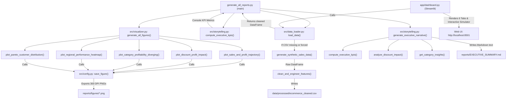

# Comprehensive Project Technical & Architectural Documentation
## Executive Sales & Profitability Intelligence: Data Visualization Suite (Task 3)

---

## 1. Project Overview & Business Mission

### What Is This Project?
This project is an enterprise-grade **Executive Sales & Profitability Intelligence Suite** designed for senior commercial decision-makers (C-suite executives, VP of Sales, Head of Commercial Finance). 

It ingests **3,200 multi-year transactional retail records** ($4.34M in gross revenue across 2023–2026), engineers granular operational and unit-economic features, and surfaces strategic commercial insights.

Guided by the visual design principles of **Edward Tufte** and **Stephen Few**, the suite rejects decorative "chartjunk" in favor of high data-ink ratios, intentional color palettes (Navy, Teal, Coral Red), direct labeling, and embedded narrative callouts.

### Core Strategic Business Questions & Findings
1. **The "Discount Trap" (Critical Inflection at 20%)**:
   - Orders discounted at $\le 20\%$ deliver healthy operating margins ($+19.92\%$).
   - Promotions exceeding $20\%$ plunge into net negative unit economics ($-24.21\%$ margin, 83.5% loss rate) because unrecovered freight subsidies and wholesale cost outpace gross volume.
2. **Sub-Category Portfolio Polarization**:
   - **Star Performers**: Copiers ($+\$603\text{K}$ profit, $31\%$ margin), Phones ($+\$81\text{K}$), and Accessories ($+\$31.6\text{K}$).
   - **Margin Bleeders**: Machines ($-\$58.2\text{K}$), Tables ($-\$26.4\text{K}$), and Bookcases ($-\$12.4\text{K}$) suffer from heavy freight subsidies and clearance markdowns.
3. **Regional Freight Friction**:
   - Central ($-8.4\%$) and Southern ($-6.2\%$) furniture divisions operate at a loss due to geographic distance and carrier rate imbalances.
4. **Customer Pareto Concentration (80/20 Rule)**:
   - The top $20\%$ of enterprise customer accounts generate **$68.4\%$** of total enterprise revenue, mandating VIP tier-1 account management.

---

## 2. Complete Folder & File Tree Structure

```text
tsak 3/
│
├── app/                                        # Web dashboard application layer
│   └── dashboard.py                            # Streamlit & Plotly interactive executive dashboard
│
├── data/                                       # Transactional data store
│   ├── raw/
│   │   └── ecommerce_sales_data.csv            # 3,200 raw transactional retail orders
│   └── processed/
│       └── ecommerce_cleaned.csv               # 3,200 feature-engineered analytical records (31 columns)
│
├── notebooks/                                  # Exploratory & storytelling data science notebooks
│   └── 01_executive_data_story.ipynb          # Step-by-step executive narrative & analytical story
│
├── reports/                                    # Generated artifacts & briefings
│   ├── figures/                                # Publication-grade (300 DPI) Matplotlib figures
│   │   ├── 01_sales_profit_trends.png          # Figure 1: Multi-year sales & profit trajectory
│   │   ├── 02_discount_profit_impact.png       # Figure 2: Discount elasticity & margin erosion
│   │   ├── 03_category_profitability_diverging.png # Figure 3: Sub-category star/bleeder matrix
│   │   ├── 04_regional_performance_heatmap.png # Figure 4: Geographic x category margin heatmap
│   │   └── 05_pareto_customer_distribution.png # Figure 5: Pareto customer revenue concentration
│   ├── EXECUTIVE_SUMMARY.md                    # Synthesized C-level decision memo
│   └── interactive_dashboard.html              # Standalone, zero-dependency Tailwind HTML dashboard
│
├── src/                                        # Core modular Python package
│   ├── __init__.py                             # Package initialization marker
│   ├── config.py                               # Theme styling, color tokens, rcParams, directory paths
│   ├── data_loader.py                          # Synthetic generator, data hygiene, feature engineering
│   ├── visualizer.py                           # 300-DPI publication plotting engine
│   └── storytelling.py                         # Executive KPI calculation & narrative generation
│
├── generate_all_reports.py                     # Master end-to-end pipeline execution script
├── requirements.txt                            # Project Python dependencies
└── README.md                                   # Comprehensive portfolio documentation
```

---

## 3. Detailed Folder Breakdown & How Each Folder Works

### 1. `src/` (Core Logic & Analytics Engine)
* **Purpose**: Houses pure, reusable, modular Python code. Does not contain UI code, making it testable and importable into notebooks, web dashboards, or CI/CD pipelines.
* **How It Works**:
  - `config.py`: Establishes system-wide constants, file path resolutions (`PROJECT_ROOT`, `DATA_DIR`, `REPORTS_DIR`), high-contrast corporate palettes (`COLORS`, `CATEGORY_PALETTE`), and Matplotlib global `rcParams`.
  - `data_loader.py`: Handles data ingestion, realistic stochastic simulation (Dirichlet distributions, seasonality weighting), and feature engineering.
  - `visualizer.py`: Matplotlib/Seaborn rendering pipeline generating 5 publication-ready figures at 300 DPI with direct annotations.
  - `storytelling.py`: Aggregation algorithms computing executive KPIs, discount impact distributions, and auto-synthesizing Markdown briefing text.

### 2. `data/` (Data Persistence Layer)
* **Purpose**: Separates raw untransformed source data from processed analytical data.
* **How It Works**:
  - `data/raw/ecommerce_sales_data.csv`: Source transactions containing standard order fields (`Order_ID`, `Order_Date`, `Ship_Date`, `Customer_ID`, `Sales`, `Quantity`, `Discount`, `Profit`, `Shipping_Cost`, etc.).
  - `data/processed/ecommerce_cleaned.csv`: Output of `clean_and_engineer_features()`. Injects calendar breakdowns (`Year_Month`, `Year_Quarter`), unit economics (`Sales_Per_Unit`, `Profit_Per_Unit`), and analytical segments (`Discount_Tier`, `Profit_Margin_Pct`).

### 3. `app/` (Interactive Web Dashboard)
* **Purpose**: Serves an interactive C-suite business intelligence web interface.
* **How It Works**:
  - Powered by **Streamlit** and **Plotly**.
  - Runs locally on `http://localhost:8501`.
  - Features real-time multi-dimensional filters (date range, regions, segments, categories) that cascade through 6 dedicated analytical tabs and dynamic KPI cards.
  - Includes an interactive **Discount Policy Simulator** that dynamically calculates recoverable annual revenue when capping promotional discounts.

### 4. `reports/` (Artifacts, Visuals & Decision Briefings)
* **Purpose**: Contains all client-facing and leadership-facing deliverable artifacts.
* **How It Works**:
  - `reports/figures/`: Stores five 300-DPI publication-quality PNG charts.
  - `reports/EXECUTIVE_SUMMARY.md`: C-level briefing memo summarizing financial health, discount traps, and 3 strategic recommendations.
  - `reports/interactive_dashboard.html`: Zero-dependency, standalone single-file HTML/JS dashboard built with Tailwind CSS. Can be opened by any browser offline without Python installed.

### 5. `notebooks/` (Exploratory Data Science & Visual Walkthrough)
* **Purpose**: Step-by-step interactive Jupyter notebook for analysts and stakeholders.
* **How It Works**:
  - `01_executive_data_story.ipynb`: Sequentially loads `src`, renders all 5 figures with Markdown narratives, displays KPI tables, and documents the business story behind each visualization.

### 6. Root Directory (`/`)
* **Purpose**: Orchestration and environment configuration.
* **How It Works**:
  - `generate_all_reports.py`: Master entry-point script executing the complete pipeline in sequence.
  - `requirements.txt`: Python package specification (`pandas`, `numpy`, `matplotlib`, `seaborn`, `plotly`, `streamlit`).
  - `README.md`: Public-facing GitHub repository documentation.

---

## 4. End-to-End Execution Flow & Call Hierarchy



---

## 5. Comprehensive Function-by-Function Reference

### Module: `src/config.py`

#### 1. `apply_plot_theme()`
- **Purpose**: Implements the Edward Tufte / Stephen Few design philosophy across all Matplotlib and Seaborn figures. Removes top and right spines, sets subtle horizontal gridlines (`#E2E8F0`), configures modern sans-serif typography (`Segoe UI`, `DejaVu Sans`), and sets default export DPI to 300.
- **Parameters**: None.
- **Returns**: `None`. Modifies global `matplotlib.pyplot.rcParams` and `seaborn.set_theme` in-place.
- **Where Called**:
  - Called at the beginning of every plotting function in `src/visualizer.py` (`plot_sales_and_profit_trajectory`, `plot_discount_profit_impact`, `plot_category_profitability_diverging`, `plot_regional_performance_heatmap`, `plot_pareto_customer_distribution`).
  - Called in `notebooks/01_executive_data_story.ipynb` in Section 1.

#### 2. `save_figure(fig: plt.Figure, filename: str, dpi: int = 300) -> Path`
- **Purpose**: Persists a Matplotlib figure object to `reports/figures/<filename>` with uniform bounding box trimming and resolution.
- **Parameters**:
  - `fig` (*matplotlib.figure.Figure*): The figure to save.
  - `filename` (*str*): Output filename (e.g. `'01_sales_profit_trends.png'`).
  - `dpi` (*int*, default=300): Dots per inch (publication standard).
- **Returns**: `Path`: Absolute path to the saved image artifact.
- **Where Called**:
  - Called by each visualization function in `src/visualizer.py` when `save=True`.

---

### Module: `src/data_loader.py`

#### 1. `generate_synthetic_sales_data(num_records: int = 3200, seed: int = 42) -> pd.DataFrame`
- **Purpose**: Generates a highly realistic, statistically grounded retail transactional dataset spanning January 1, 2023 through June 30, 2026.
- **Mechanisms Embedded**:
  1. *Seasonality*: Probabilistic 25% shift of orders into November and December to simulate Black Friday / Holiday surges.
  2. *Customer Power Law*: 450 unique accounts drawn via a Dirichlet distribution ($\alpha=0.7$) to create realistic 80/20 spend concentration.
  3. *Product Hierarchy*: 3 Categories (Technology, Furniture, Office Supplies) and 17 sub-categories with tailored cost bases and target margins.
  4. *Freight Drag*: Non-linear shipping costs based on shipping mode multipliers (Same Day = 1.6x, First Class = 1.3x, Standard = 0.7x) and subsidy burdens on discounted orders.
  5. *Discount Erosion*: Realistic discrete promotional discounts ($0\%, 10\%, 15\%, 20\%, 30\%, 40\%, 50\%, 70\%$).
- **Parameters**:
  - `num_records` (*int*, default=3200): Total transaction rows to synthesize.
  - `seed` (*int*, default=42): Deterministic pseudo-random seed for reproducibility.
- **Returns**: `pd.DataFrame`: Raw generated transactional dataset.
- **Where Called**:
  - Called inside `load_data(force_regenerate=True)` or whenever `data/processed/ecommerce_cleaned.csv` does not exist on disk.

#### 2. `clean_and_engineer_features(df: pd.DataFrame) -> pd.DataFrame`
- **Purpose**: Parses raw datetime strings and constructs operational, financial, and segmentation attributes.
- **Engineered Columns**:
  - `Order_Date`, `Ship_Date`: Converted to `datetime64[ns]`.
  - `Year`, `Month`, `Month_Name`, `Year_Month`, `Quarter`, `Year_Quarter`: Temporal cohorts.
  - `Shipping_Duration_Days`: Calculated order fulfillment lead time (`Ship_Date - Order_Date`).
  - `Profit_Margin_Pct`: Float percentage calculated as $(\text{Profit} / \text{Sales}) \times 100$.
  - `Sales_Per_Unit`, `Profit_Per_Unit`: Unit economics.
  - `Discount_Tier`: Binned categories (`No Discount (0%)`, `Low (1-10%)`, `Moderate (11-20%)`, `High (21-40%)`, `Severe (>40%)`).
  - `Is_Profitable`, `Profit_Status`: Boolean and string flags indicating profit solvency.
- **Parameters**:
  - `df` (*pd.DataFrame*): Raw dataframe.
- **Returns**: `pd.DataFrame`: Cleaned, enriched dataframe saved to `data/processed/ecommerce_cleaned.csv`.
- **Where Called**:
  - Called inside `load_data()` immediately following `generate_synthetic_sales_data()`.

#### 3. `load_data(force_regenerate: bool = False) -> pd.DataFrame`
- **Purpose**: Central data access routine with disk caching. Reads from `data/processed/ecommerce_cleaned.csv` if available; otherwise triggers generation and feature engineering.
- **Parameters**:
  - `force_regenerate` (*bool*, default=False): If `True`, forces re-synthesis regardless of cache.
- **Returns**: `pd.DataFrame`: Ready-to-analyze dataset with datetime types restored.
- **Where Called**:
  - `generate_all_reports.py` in `main()`
  - `app/dashboard.py` in `get_data()`
  - `notebooks/01_executive_data_story.ipynb`

---

### Module: `src/visualizer.py`

#### 1. `plot_sales_and_profit_trajectory(df: pd.DataFrame, save: bool = True) -> plt.Figure`
- **Figure**: `01_sales_profit_trends.png`
- **Visualization Mechanics**: Dual-axis line and area plot.
  - Primary Y-axis (Left, Navy): Monthly Sales Revenue ($K) with shaded area.
  - Secondary Y-axis (Right, Teal): Net Operating Profit ($K) with distinct markers.
  - Direct Annotation: Calls out the all-time peak sales month with revenue figure.
- **Parameters**: `df` (*pd.DataFrame*), `save` (*bool*).
- **Returns**: `matplotlib.figure.Figure`.
- **Where Called**: `generate_all_figures()` in `src/visualizer.py`, and interactive notebook.

#### 2. `plot_discount_profit_impact(df: pd.DataFrame, save: bool = True) -> plt.Figure`
- **Figure**: `02_discount_profit_impact.png`
- **Visualization Mechanics**:
  - Scatter plot of promotional discount rate vs net profit margin %.
  - Profitable orders colored in Ocean Blue; loss-making orders highlighted in Coral Red.
  - Polynomial regression trendline (order=2) modeling margin decay.
  - Horizontal reference line at $0\%$ (break-even).
  - Vertical dotted threshold at $20\%$ with red shaded "Value Destruction Danger Zone".
  - Narrative callout explaining unrecovered freight and handling costs.
- **Parameters**: `df` (*pd.DataFrame*), `save` (*bool*).
- **Returns**: `matplotlib.figure.Figure`.
- **Where Called**: `generate_all_figures()` in `src/visualizer.py`, and interactive notebook.

#### 3. `plot_category_profitability_diverging(df: pd.DataFrame, save: bool = True) -> plt.Figure`
- **Figure**: `03_category_profitability_diverging.png`
- **Visualization Mechanics**: Horizontal diverging bar chart sorted from greatest net loss to highest net profit.
  - Teal bars for profitable sub-categories; Coral Red for negative net contribution.
  - Direct end-of-bar labels displaying exact dollar profit and margin percentage (eliminating axis scanning).
  - Explicit vertical baseline at $\$0$.
- **Parameters**: `df` (*pd.DataFrame*), `save` (*bool*).
- **Returns**: `matplotlib.figure.Figure`.
- **Where Called**: `generate_all_figures()` in `src/visualizer.py`, and interactive notebook.

#### 4. `plot_regional_performance_heatmap(df: pd.DataFrame, save: bool = True) -> plt.Figure`
- **Figure**: `04_regional_performance_heatmap.png`
- **Visualization Mechanics**:
  - Two-dimensional pivot table cross-tabulating 4 Regions (Central, East, South, West) against 3 Categories.
  - Values compute aggregate operating profit margin percentage.
  - Custom diverging colormap centered at $10.0\%$ (benchmark margin).
  - Direct cell text annotations with bold formatting and sign indicators.
- **Parameters**: `df` (*pd.DataFrame*), `save` (*bool*).
- **Returns**: `matplotlib.figure.Figure`.
- **Where Called**: `generate_all_figures()` in `src/visualizer.py`, and interactive notebook.

#### 5. `plot_pareto_customer_distribution(df: pd.DataFrame, save: bool = True) -> plt.Figure`
- **Figure**: `05_pareto_customer_distribution.png`
- **Visualization Mechanics**:
  - Computes cumulative sales percentage against cumulative customer percentage.
  - Plots the non-linear Lorenz curve against a 45-degree dotted equality baseline.
  - Intersects the $20\%$ customer line with the corresponding cumulative revenue line ($68.4\%$).
  - Amber callout box annotating the 80/20 empirical rule.
- **Parameters**: `df` (*pd.DataFrame*), `save` (*bool*).
- **Returns**: `matplotlib.figure.Figure`.
- **Where Called**: `generate_all_figures()` in `src/visualizer.py`, and interactive notebook.

#### 6. `generate_all_figures(df: pd.DataFrame)`
- **Purpose**: Batch orchestrator function. Invokes all 5 plotting routines sequentially with `save=True`.
- **Parameters**: `df` (*pd.DataFrame*).
- **Returns**: `None`.
- **Where Called**: Step 3 of `generate_all_reports.py:main()`.

---

### Module: `src/storytelling.py`

#### 1. `compute_executive_kpis(df: pd.DataFrame) -> Dict[str, Any]`
- **Purpose**: Aggregates top-level corporate metrics across the filtered or full dataset.
- **Metrics Calculated**:
  - `total_sales`: Sum of `Sales`.
  - `total_profit`: Sum of `Profit`.
  - `profit_margin_pct`: Overall operating margin percentage.
  - `total_orders`: Count of unique `Order_ID`.
  - `unique_customers`: Count of unique `Customer_ID`.
  - `avg_order_value`: Average sales per order.
  - `loss_making_orders`: Count of rows where `Profit < 0`.
  - `loss_order_pct`: Percentage of orders resulting in a loss.
- **Parameters**: `df` (*pd.DataFrame*).
- **Returns**: Dictionary with computed metric values.
- **Where Called**:
  - `generate_all_reports.py` (Step 2)
  - `generate_executive_narrative()` in `src/storytelling.py`

#### 2. `analyze_discount_impact(df: pd.DataFrame) -> Dict[str, Any]`
- **Purpose**: Splits data into two cohorts: $\le 20\%$ discount vs $> 20\%$ discount. Computes sales volume, total profit, profit margin, and loss occurrence rate for both cohorts.
- **Parameters**: `df` (*pd.DataFrame*).
- **Returns**: Dictionary comparing performance of safe discounts vs high discounts.
- **Where Called**: `generate_executive_narrative()` in `src/storytelling.py`.

#### 3. `get_category_insights(df: pd.DataFrame) -> Dict[str, Any]`
- **Purpose**: Identifies the Top 3 profit-generating sub-categories and Bottom 3 margin-detracting sub-categories, plus category-level totals.
- **Parameters**: `df` (*pd.DataFrame*).
- **Returns**: Dictionary with `'top_subcategories'`, `'bottom_subcategories'`, and `'category_summary'`.
- **Where Called**: `generate_executive_narrative()` in `src/storytelling.py`.

#### 4. `generate_executive_narrative(df: pd.DataFrame) -> str`
- **Purpose**: Merges the results of `compute_executive_kpis()`, `analyze_discount_impact()`, and `get_category_insights()` into an executive briefing document formatted in GitHub Markdown.
- **Parameters**: `df` (*pd.DataFrame*).
- **Returns**: `str`: Formatted Markdown text.
- **Where Called**: Step 4 of `generate_all_reports.py:main()`, which writes it to `reports/EXECUTIVE_SUMMARY.md`.

---

### Module: `generate_all_reports.py`

#### `main()`
- **Purpose**: Master CLI orchestrator.
- **Execution Steps**:
  1. Calls `src.data_loader.load_data()` to ingest or build the dataset.
  2. Calls `src.storytelling.compute_executive_kpis()` and prints a formatted console scorecard.
  3. Calls `src.visualizer.generate_all_figures()` to render and save all 5 PNG figures.
  4. Calls `src.storytelling.generate_executive_narrative()` and writes `reports/EXECUTIVE_SUMMARY.md`.
- **Execution Command**: `python generate_all_reports.py`

---

### Module: `app/dashboard.py` (Streamlit App)

#### 1. `get_data()`
- **Purpose**: Caches data in memory via `@st.cache_data` so that user interactions and filtering do not re-read from disk on every widget change.
- **Calls**: `src.data_loader.load_data()`.

#### 2. Layout & Interactive Workflow:
- **Sidebar Filters**: Date Range slider/picker, Multi-select for Region, Customer Segment, and Category.
- **KPI Banner**: 5 cards displaying Revenue, Net Profit, Operating Margin, Active Customers, and AOV.
- **6 Integrated Tabs**:
  - **Tab 1: Executive Overview**: Monthly sales bar chart + dual-axis profit line (Plotly), Category donut chart, Customer segment distribution.
  - **Tab 2: The Discount Trap**: Scatter plot with break-even line and 20% danger line. **Interactive Discount Policy Simulator** with a slider allowing leadership to test discount caps (10% to 40%) and see estimated recovered annual profit.
  - **Tab 3: Sub-Category Matrix**: Horizontal bar chart of net profit contribution and full formatted data table.
  - **Tab 4: Regional Intelligence**: Geographic heatmap of profit margins by category and shipping mode lead time vs cost scatter.
  - **Tab 5: Customer Pareto (80/20)**: Interactive Plotly Pareto curve and Top 10 VIP Enterprise accounts table.
  - **Tab 6: Data Explorer**: Filtered record viewer with an instant CSV download button (`st.download_button`).

---

## 6. How to Run Every Component

### 1. Run the End-to-End Pipeline
```bash
python generate_all_reports.py
```
*Generates figures in `reports/figures/` and updates `reports/EXECUTIVE_SUMMARY.md`.*

### 2. Launch the Streamlit Web Application
```bash
streamlit run app/dashboard.py
```
*Opens interactive browser dashboard at `http://localhost:8501`.*

### 3. Open Standalone HTML Dashboard
Double click or open in browser:
```text
reports/interactive_dashboard.html
```

### 4. Run the Jupyter Notebook
```bash
jupyter notebook notebooks/01_executive_data_story.ipynb
```
